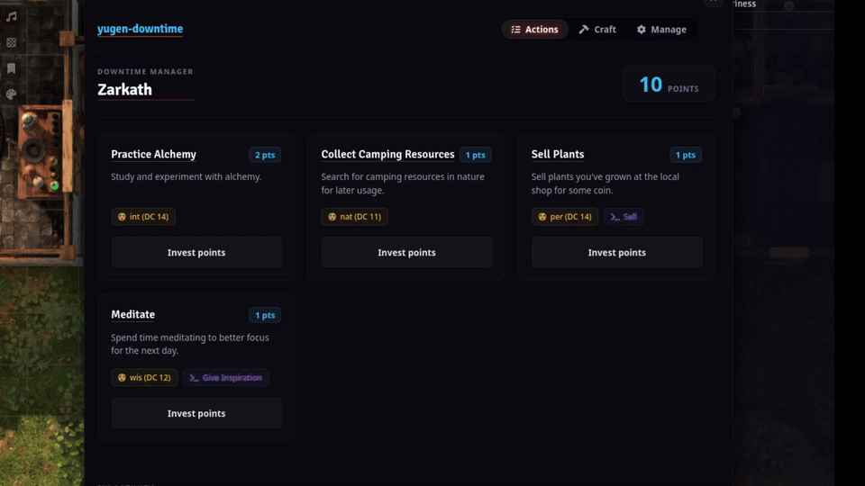
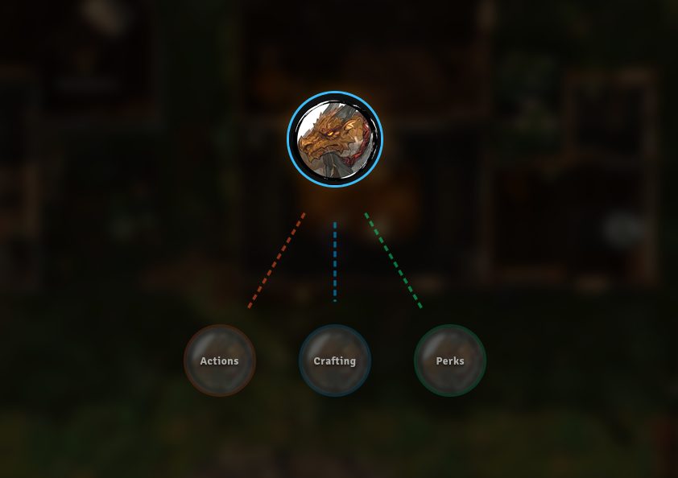

# yugen-downtime

A downtime/in-between sessions manager for Foundry VTT v13 & v14. This allows Dungeon Masters/GMs to toggle a global downtime mode during Long Rests or whenever reasonable, giving virtual "downtime points" to player characters, and define custom downtime action templates that players can buy to trigger macros.

See examples below for practical usage:

---

## Features

- Automatic Downtime Points for Long Rest and Short Rests.
- Multiple Downtime Actions that can be assigned to macros. Checks and rolls are automatically handled.
- Logging system to keep track of downtime actions and points.

